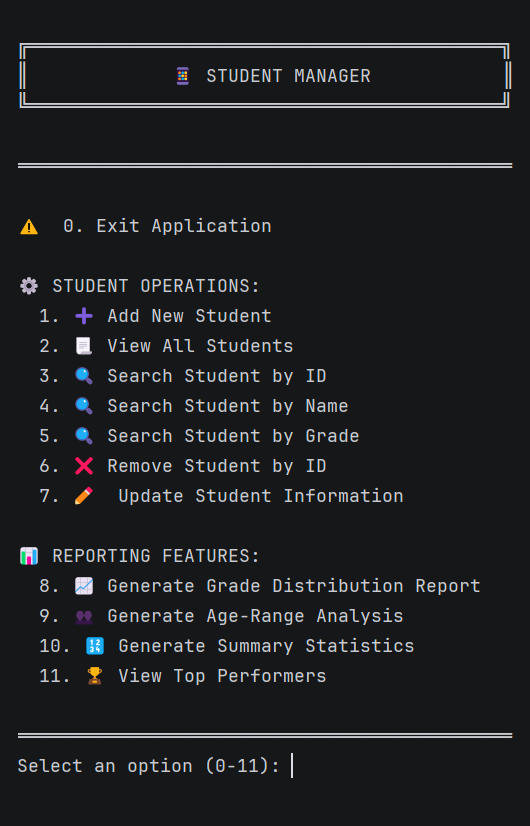
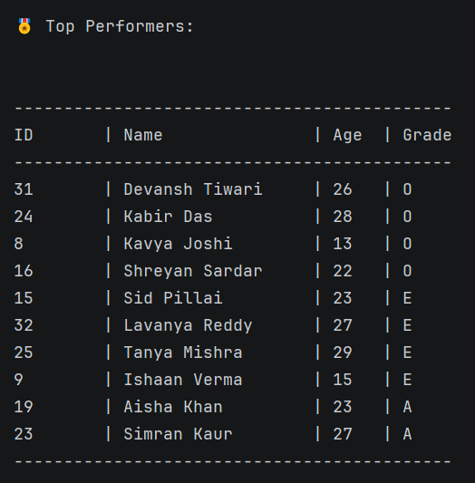

# 🎓 Student Management System

A beginner-friendly Java-based project that lets you manage student records via a console interface. It’s a great way to learn key concepts like JDBC, Maven, and basic console UI development.

> 💡 *My first Java project started small and has grown steadily in features and robustness.*

---

## 🚀 Overview

- **Purpose:** Manage student records using a console-based application.
- **Core Features:**
    - CRUD operations (Create, Read, Update, Delete)
    - **MySQL Database Integration:** Upgraded from file-based storage for better data management.
    - Input validation and error handling for a smoother user experience.

---

## 📸 Demo

Experience a quick look at the console interface:

<div align="center">
  
  <br>
  <em>Figure 1: Console-based student management interface</em>
</div>

---

## 🛠️ Technologies Used

- 
- 
- 

---

## ✅ Prerequisites

Before you start, make sure you have:

- **Java 21:** Check with:
    ```powershell
    java -version
    ```
- **Maven 3.9+:** Check with:
    ```powershell
    mvn -version
    ```
- **MySQL 9.2.0:** Ensure it’s installed and running.
- **IDE:** IntelliJ IDEA is recommended for seamless development.

---

## 🔧 Installation & Setup

Follow these steps to set up the project:

1. **Clone the Repository:**
    ```powershell
    git clone https://github.com/ShreyanGit-5/student-management-system.git
    ```

2. **Set Up MySQL:**
    - **Create a Database:**
    ```sql
    CREATE DATABASE student_db;
    ```

    - **Create a `students` Table:**
    ```sql
    CREATE TABLE students (
        id INT AUTO_INCREMENT PRIMARY KEY,
        name VARCHAR(50) NOT NULL,
        age INT NOT NULL,
        grade VARCHAR(2) NOT NULL
    );
    ```

3. **Import the Project:**
    - Open the project in IntelliJ IDEA (or your favorite IDE).

4. **Configure the Database Connection:**
    - Update the `database.properties` file with your credentials:
    ```
    db.url = jdbc:mysql://localhost:3306/student_db
    db.user = root
    db.password = your_password  # Replace with your actual password
    ```

5. **Run the Application:**
    - In IntelliJ, select `Run > Main.java` to start the console app.

---

## ⚙️ Features & Usage

### Basic Operations

- **Adding a Student:**
    - The system will prompt you for:
        ```
        Enter student name: John Doe
        Enter age: 20
        Enter grade: A
        ```

- **Displaying Students:**
    - See a list of students with details:
        ```
        ID: 1 | Name: John Doe | Age: 20 | Grade: A
        ```

### Advanced Features

- **Database Integration:**
    - Uses JDBC with `PreparedStatement` for secure SQL operations.
    - Upgraded from a file-based system to a robust MySQL database.
- **Input Validation & Error Handling:**
    - Checks for valid entries (e.g., proper age ranges, correct grade formats) and handles exceptions gracefully.
- **Reporting Tools:**
    - 📈 **Grade Distribution Report:**  
      Visualizes student grade patterns and trends.

    - 👥 **Age-Range Analysis:**
      
      Displays the distribution of students across different age groups.
      
      <div align="center">
        
        <br>
        <em>Figure 2: Age-range analysis of students</em>
      </div>  

    - 🔢 **Summary Statistics:**  
      Provides aggregate data like average age, total students, etc.

    - 🏆 **Top Performers Overview:**
      
      Highlights students with the highest academic performance.
      
      <div align="center">
        
        <br>
        <em>Figure 3: Top performers overview</em>
      </div>  

---

## 📂 Project Structure

```
StudentManagementSystem
├── src
│   ├── main
│   │   ├── java
│   │   │   └── com.student.management
│   │   │       ├── main
│   │   │       │   └── Main.java           // Entry point
│   │   │       ├── model
│   │   │       │   └── Student.java        // Student entity
│   │   │       ├── service
│   │   │       │   └── StudentManager.java // Core logic
│   │   │       └── util
│   │   │           └── DBConnection.java   // Database utility
│   │   └── resources
│   │       └── database.properties         // DB configuration
│   ├── test
│   │   └── java
│   │       └── com.student.management      // Unit tests
├── pom.xml                                 // Maven configuration
└── (other project files)
```

---

## 🗓️ Milestones & Development Journey

- **Feb 22, 2025:** Project foundation established.
- **Mar 2, 2025:** Completed advanced reporting features.
- **Mar 20, 2025:** Implemented database connection (upgraded from file-based storage).
- **Mar 21, 2025:** Configured JDBC integration & Maven dependencies.

> ✅ Key takeaway: Develop incrementally, validate your code frequently, and build upon your successes!
