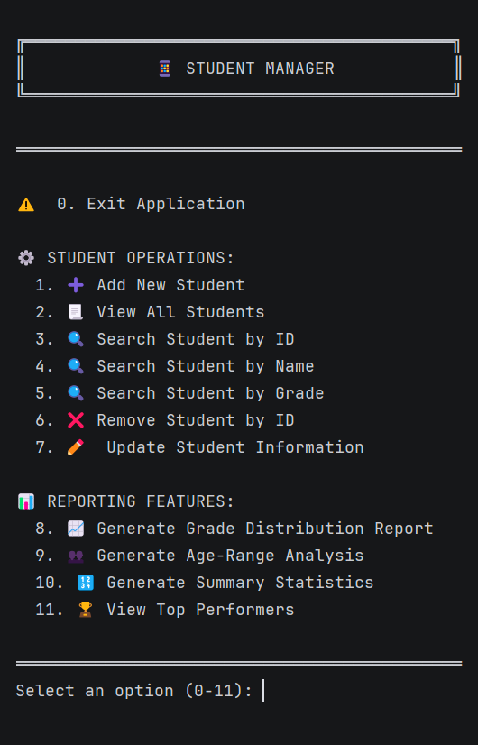
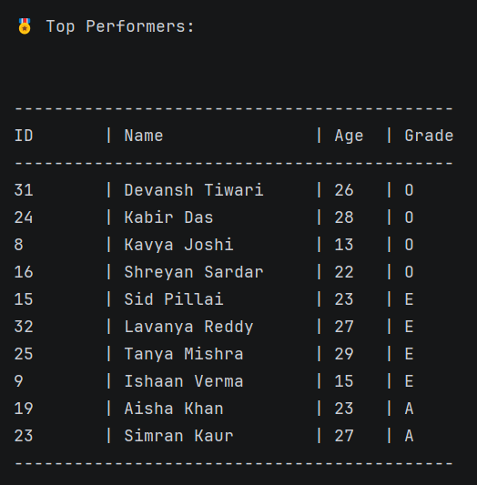
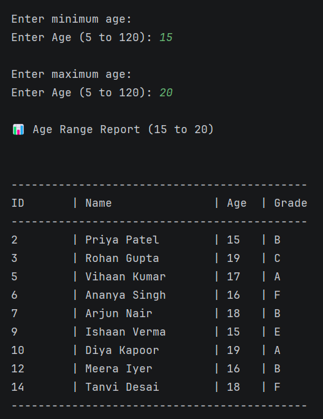

# 🎓 Student Management System

A terminal-based Java application to manage student records. Built with MySQL and JDBC (using parameterized queries to prevent SQL injection).

---

## 📸 Demo

<div align="center">

| Console Interface | Top Performers | Age-Range Analysis |
| :---: | :---: | :---: |
|  |  |  |

</div>

---

## ✨ Features

- **Full CRUD:** Create, read, update, and delete student records. Search by ID, name, or grade.
- **Analytics & Reporting:** Quick insights on grade distribution, age range analysis, general statistics, and top performers.
- **Security First:** Parameterized JDBC queries to prevent SQL injection.
- **Clean Architecture:** Separated layers for models, services, and database configs to keep the codebase maintainable.

---

## 🛠️ Requirements

- Java JDK 21+
- Maven 3.9+
- MySQL 8.0+

---

## 🚀 Setup & Installation

### 1. Initialize MySQL Database
Run the schema script:
```bash
mysql -u root -p < database/schema.sql
```
*(Or manually execute the SQL statements in `database/schema.sql` inside your SQL client).*

### 2. Configure Credentials
1. Go to `src/main/resources/`.
2. Copy `database.properties.example` to `database.properties`.
3. Update `db.username` and `db.password` with your MySQL credentials.

---

## 🏃 Running the Application

### IDE
Open the project, let Maven download dependencies, and run the `Main.java` file.

### Command Line
Run via Maven:
```bash
mvn clean compile exec:java -Dexec.mainClass="com.student.management.main.Main"
```

---

## 🧪 Testing

Run the test suite:
```bash
mvn test
```

