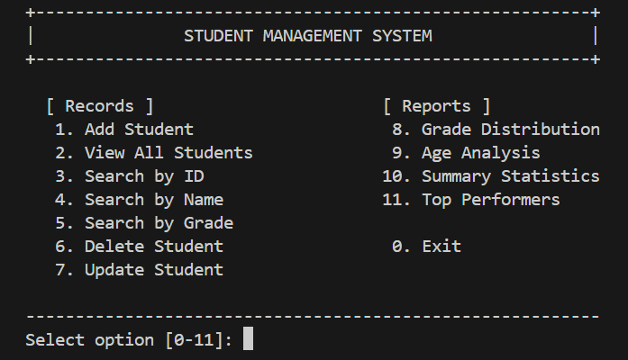
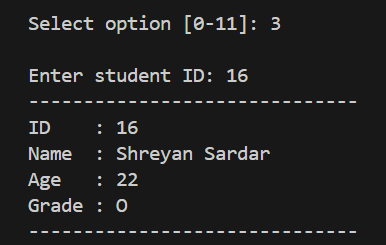
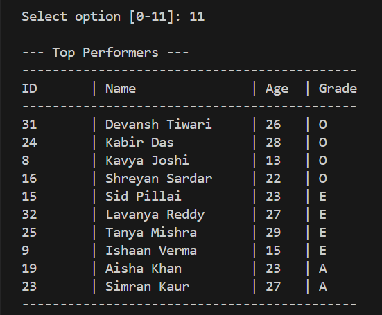
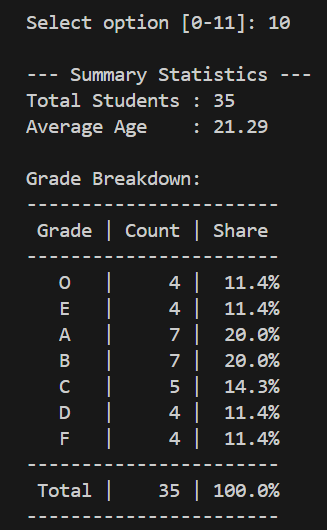

# Student Management System

Console-based Java application for managing student records and generating SQL analytics with MySQL and JDBC.

[](#)
[](https://www.mysql.com/)

---

## Preview

<div align="center">

| Main Dashboard | Student Lookup |
| :---: | :---: |
|  |  |
| **Top Performers (SQL Sort)** | **Summary Statistics (Aggregations)** |
|  |  |

</div>

---

## Features

- **Student Records:** Add, view, update, and delete student records backed by MySQL.
- **Flexible Search:** Query records by ID, partial name (`LIKE`), or letter grade.
- **SQL Analytics:** Grade distributions with percentage shares, age-range filters, summary stats, and top performers.
- **Input Validation:** Strict type and boundary checks on names, ages (5–120), and letter grades.
- **Parameterized Queries:** All SQL queries use `PreparedStatement` to prevent SQL injection.

---

## Tech Stack

- **Core:** Java 21, JDBC
- **Database:** MySQL 8.0+
- **Build & Test:** Maven, JUnit 5

---

## Getting Started

### Prerequisites

- **Java**: JDK `21+`
- **Database**: MySQL Server `8.0+`
- **Build**: Maven `3.9+`

### 1. Database Setup

Import the schema into MySQL:

```bash
mysql -u root -p < database/schema.sql
```

> **Windows PowerShell:**
> ```powershell
> Get-Content database/schema.sql | mysql -u root -p
> ```

### 2. Configuration

Copy the example configuration:

```bash
cp src/main/resources/database.properties.example src/main/resources/database.properties
```

> **Windows CMD:**
> ```cmd
> copy src\main\resources\database.properties.example src\main\resources\database.properties
> ```

Update `src/main/resources/database.properties` with your credentials:

```properties
db.url=jdbc:mysql://localhost:3306/students_db
db.username=your_user
db.password=your_password
```

### 3. Run Application

```bash
mvn compile exec:java
```

*(Or run [`Main.java`](src/main/java/com/student/management/main/Main.java) directly in your IDE).*

### 4. Run Tests

```bash
mvn test
```

---

## Author

**Shreyan Sardar** — [Portfolio](https://shreyandev.vercel.app) · [GitHub](https://github.com/ShreyanDev5) · [LinkedIn](https://www.linkedin.com/in/shreyansardar/)
