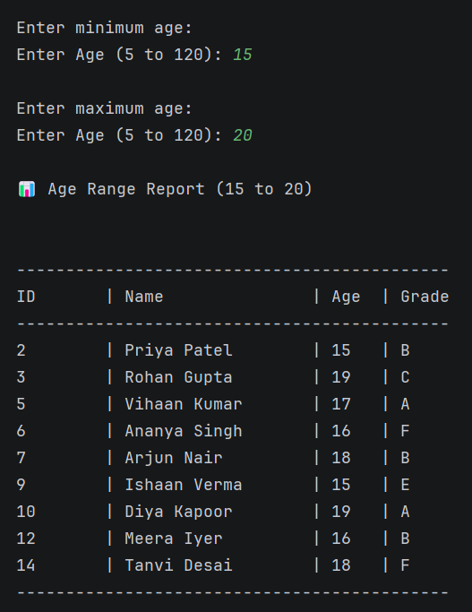

# 🎓 Student Management System

A beginner-friendly Java-based project that lets you manage student records via a console interface. It’s a great way to learn key concepts like JDBC, Maven, and basic console UI development.

> 💡 *My first Java project started small and has grown steadily in features and robustness.*

---

## 🚀 Overview

- **Purpose:** Manage student records using a console-based application.
- **Core Features:**
    - CRUD operations (Create, Read, Update, Delete)
    - **MySQL Database Integration:** Upgraded from file-based storage for better data management.
    - Input validation and error handling for a smoother user experience.

---

## 📸 Demo

Experience a quick look at the console interface:


---

## 🛠️ Technologies Used

- 
- 
- 

---

## ✅ Prerequisites

Before you start, make sure you have:

- **Java 21:** Check with:
    ```powershell
    java -version
    ```
- **Maven 3.9+:** Check with:
    ```powershell
    mvn -version
    ```
- **MySQL 9.2.0:** Ensure it’s installed and running.
- **IDE:** IntelliJ IDEA is recommended for seamless development.

---

## 🔧 Installation & Setup

Follow these steps to set up the project:

1. **Clone the Repository:**
    ```powershell
    git clone https://github.com/ShreyanGit-5/student-management-system.git
    ```

2. **Set Up MySQL:**
    - **Create a Database:**
    ```sql
    CREATE DATABASE student_db;
    ```

    - **Create a `students` Table:**
    ```sql
    CREATE TABLE students (
        id INT AUTO_INCREMENT PRIMARY KEY,
        name VARCHAR(50) NOT NULL,
        age INT NOT NULL,
        grade VARCHAR(2) NOT NULL
    );
    ```

3. **Import the Project:**
    - Open the project in IntelliJ IDEA (or your favorite IDE).

4. **Configure the Database Connection:**
    - Update the `database.properties` file with your credentials:
    ```
    db.url = jdbc:mysql://localhost:3306/student_db
    db.user = root
    db.password = your_password  # Replace with your actual password
    ```

5. **Run the Application:**
    - In IntelliJ, select `Run > Main.java` to start the console app.

---


## ⚙️ Features & Usage

### Basic Operations

- **Adding a Student:**
    - The system will prompt you for:

        ```
        Enter student name: John Doe
        Enter age: 20
        Enter grade: A
        
        ```

- **Displaying Students:**
    - See a list of students with details:

        ```
        ID: 1 | Name: John Doe | Age: 20 | Grade: A
        
        ```


### Advanced Features

- **Database Integration:**
    - Uses JDBC with `PreparedStatement` for secure SQL operations.
    - Upgraded from a file-based system to a robust MySQL database.
- **Input Validation & Error Handling:**
    - Checks for valid entries (e.g., proper age ranges, correct grade formats) and handles exceptions gracefully.
- **Reporting Tools:**
    - 📈 **Grade Distribution Report:**  
      Visualizes student grade patterns and trends.

    - 👥 **Age-Range Analysis:**
      <div align="center">
        
      </div>  
      Displays the distribution of students across different age groups.

    - 🔢 **Summary Statistics:**  
      Provides aggregate data like average age, total students, etc.

    - 🏆 **Top Performers Overview:**
      <div align="center">
        
      </div>  
      Highlights students with the highest academic performance.

---

## 📂 Project Structure

```
StudentManagementSystem
├── src
│   ├── main
│   │   ├── java
│   │   │   └── com.student.management
│   │   │       ├── main
│   │   │       │   └── Main.java           // Entry point
│   │   │       ├── model
│   │   │       │   └── Student.java        // Student entity
│   │   │       ├── service
│   │   │       │   └── StudentManager.java // Core logic
│   │   │       └── util
│   │   │           └── DBConnection.java   // Database utility
│   │   └── resources
│   │       └── database.properties         // DB configuration
│   ├── test
│   │   └── java
│   │       └── com.student.management      // Unit tests
├── pom.xml                                 // Maven configuration
└── (other project files)

```

---

## 🗓️ Milestones & Development Journey

- **Feb 22, 2025:** Project foundation established.
- **Mar 2, 2025:** Completed advanced reporting features.
- **Mar 20, 2025:** Implemented database connection (upgraded from file-based storage).
- **Mar 21, 2025:** Configured JDBC integration & Maven dependencies.

> ✅ Key takeaway: Develop incrementally, validate your code frequently, and build upon your successes!
>

---

## 🚀 Future Roadmap

- **GUI Upgrade:**
    - Transition from a console-based UI to a modern GUI using JavaFX for a more intuitive experience.
- **User Authentication:**
    - Add role-based access (e.g., admin vs. student) for improved security.
- **Executable JAR Build:**
    - Package the application into an executable JAR file:
        - Compile the code.
        - Create a manifest file to specify the main class.
        - Bundle everything into one standalone package.
    - *Status:* Not yet implemented – this remains in the future roadmap.
- **Testing Enhancements:**
    - Introduce comprehensive unit tests using **JUnit 5** to ensure the reliability of core functionalities.

---

## 📝 License
[](https://opensource.org/licenses/MIT)  
This project is licensed under the MIT License. Feel free to modify and build upon it.

```plaintext
MIT License

Copyright (c) 2025 Shreyan

Permission is hereby granted, free of charge, to any person obtaining a copy
of this software and associated documentation files (the "Software"), to deal
in the Software without restriction, including without limitation the rights
to use, copy, modify, merge, publish, distribute, sublicense, and/or sell
copies of the Software, and to permit persons to whom the Software is
furnished to do so, subject to the following conditions:

The above copyright notice and this permission notice shall be included in all
copies or substantial portions of the Software.

THE SOFTWARE IS PROVIDED "AS IS", WITHOUT WARRANTY OF ANY KIND, EXPRESS OR
IMPLIED, INCLUDING BUT NOT LIMITED TO THE WARRANTIES OF MERCHANTABILITY,
FITNESS FOR A PARTICULAR PURPOSE AND NONINFRINGEMENT. IN NO EVENT SHALL THE
AUTHORS OR COPYRIGHT HOLDERS BE LIABLE FOR ANY CLAIM, DAMAGES OR OTHER
LIABILITY, WHETHER IN AN ACTION OF CONTRACT, TORT OR OTHERWISE, ARISING FROM,
OUT OF OR IN CONNECTION WITH THE SOFTWARE OR THE USE OR OTHER DEALINGS IN THE
SOFTWARE.
```